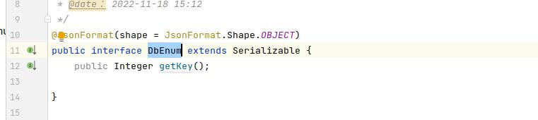
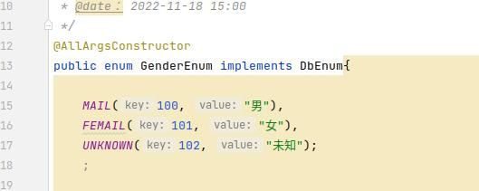
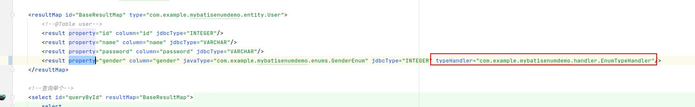
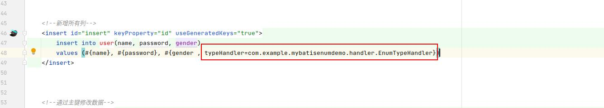
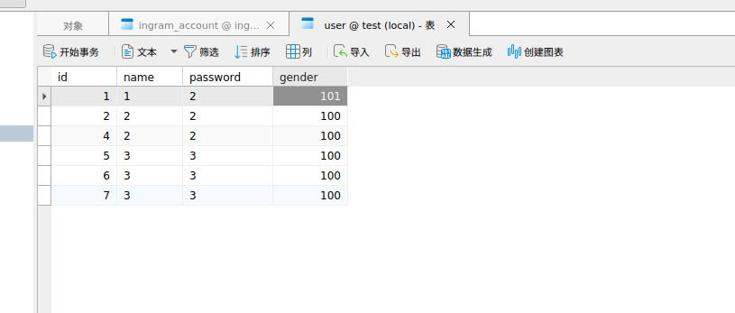
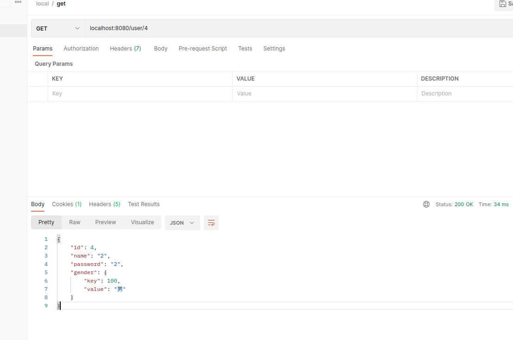

# Mybatis针对枚举值的处理

#### 介绍
##### 1. 用户管理中存储男女对应的key值100、101 

##### 2. 定义枚举类GenderEnum 继承 DbEnum接口
```java 
//DbEnum:
@JsonFormat(shape = JsonFormat.Shape.OBJECT)
public interface DbEnum extends Serializable {
    public Integer getKey();

}

```


```java
// GenderEnum枚举类
@AllArgsConstructor
public enum GenderEnum implements DbEnum{

    MAIL(100, "男"),
    FEMAIL(101, "女"),
    UNKNOWN(102, "未知");
    ;


    private Integer key;

    private String value;

    public String getValue() {
        return value;
    }

    @Override
    public Integer getKey() {
        return key;
    }
}

```



##### 3.定义枚举类的处理器

```java
public class EnumTypeHandler extends BaseTypeHandler<DbEnum> {

    private Class<DbEnum> enumClass;

    public EnumTypeHandler(Class<DbEnum> enumClass) {
        this.enumClass = enumClass;
    }

    /**
     * 设置存入数据库的值
     * @param preparedStatement
     * @param i
     * @param dbEnum
     * @param jdbcType
     * @throws SQLException
     */
    @Override
    public void setNonNullParameter(PreparedStatement preparedStatement, int i, DbEnum dbEnum, JdbcType jdbcType) throws SQLException {
        preparedStatement.setInt(i, dbEnum.getKey());
    }

    /**
     * 从数据库返回的处理
     * @param resultSet
     * @param s
     * @return
     * @throws SQLException
     */
    @Override
    public DbEnum getNullableResult(ResultSet resultSet, String s) throws SQLException {
        int anInt = resultSet.getInt(s);
        return getEnum(anInt);
    }

    /**
     * 用来查询操作，直接利用结果集返回，columnName为列名
     * @param resultSet
     * @param i
     * @return
     * @throws SQLException
     */
    @Override
    public DbEnum getNullableResult(ResultSet resultSet, int i) throws SQLException {
        return getEnum(resultSet.getInt(i));
    }

    /**
     * 用来存储过程的查询操作，直接利用结果集返回，columnIndex是列索引
     * @param callableStatement
     * @param i
     * @return
     * @throws SQLException
     */
    @Override
    public DbEnum getNullableResult(CallableStatement callableStatement, int i) throws SQLException {
        return getEnum(callableStatement.getInt(i));
    }

    private DbEnum getEnum(Integer key) {
        DbEnum[] enumConstants = enumClass.getEnumConstants();
        if (Objects.nonNull(enumConstants)) {
            for (DbEnum enumConstant : enumConstants) {
                if (Objects.equals(enumConstant.getKey(), key)) {
                    return enumConstant;
                }
            }
        }
        return null;
    }
}

```

##### 4.在xml文件中枚举字段定义枚举处理器

##### 1）查询


##### 2）插入



##### 5.结果

##### 1）插入


##### 2) 查询

